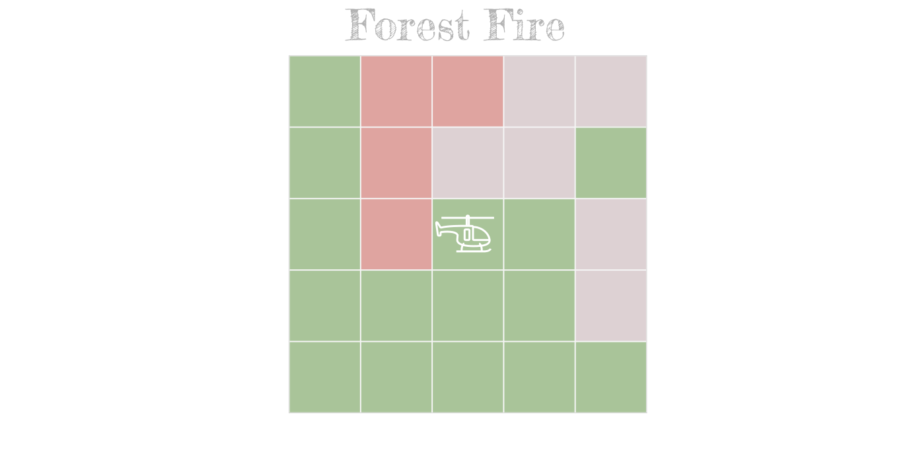

# Forest Fire Environment Helicopter V0 #

## Description ##

Here is a game over the Game of Life Cellular Automata [Conway (1970)]. 
At each step, we can select one or n cells in the grid, changing its value. 
That is, from live to dead or from dead to living, respectively. 
The goal is to maximize the amount of life in the grid at each time step.

The reward is $+1$ per cell live and $0$ per dead cell at each time step.

The system finishes when the grid is empty or at attaining the maximum steps. 

The actions are the ordered pairs (row, col), representing the cell's position to change its value. Aditional, we can execute the None action, where we don't make any movement in the grid. 

